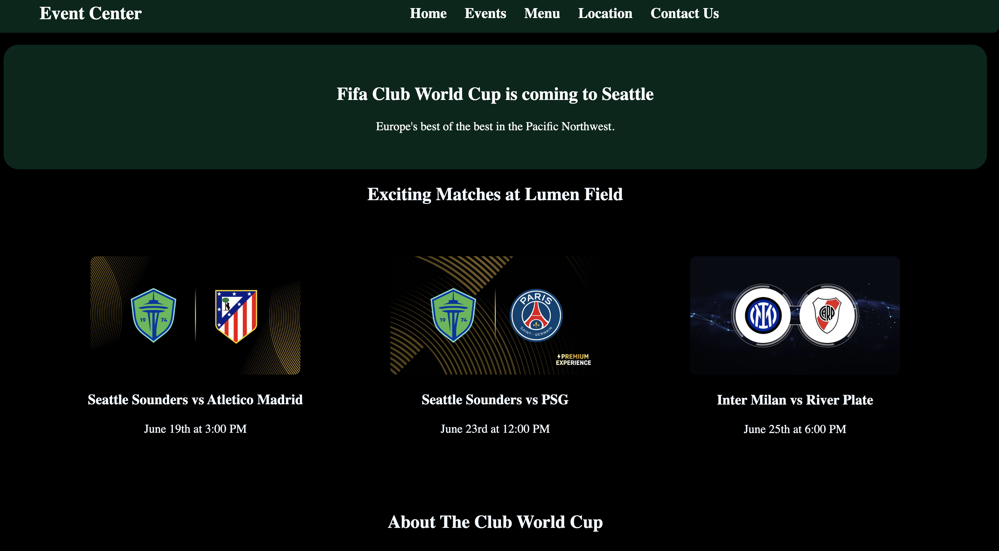

  

<h1 align="center">⚽ Club World Cup 2025 at Lumen Field</h1>

  A responsive, modern webpage built using <strong>HTML</strong> and <strong>CSS</strong> to promote a soccer match event. 
  Designed with mobile-first principles and Flexbox for layout responsiveness.

---

## 🔗 Live Demo

  👉 <a href="https://html-css-project-6-2025.netlify.app" target="_blank"><strong>View the Live Project</strong></a>

---

## 🌟 Features

- Fully responsive layout using **Flexbox**
- Clean and modern **HTML5/CSS3** structure
- Match details section (date, teams)
- Media-ready layout for images and text alignment
- Mobile-friendly and desktop-optimized

---

## 🛠️ Technologies Used

- HTML5
- CSS3
- Flexbox

---

## 🚀 How to Use

1. Clone the repository:

https://github.com/SamiirDeveloper/HTML-CSS-PROJECT 

---

## ✅ To-Do / Improvements

- Add animation on scroll
- Integrate with a ticketing API
- Add team player cards and stats
- Add countdown timer to match start

---

## 💼 Portfolio Impact

This project demonstrates:
- HTML/CSS layout mastery
- Responsive design with Flexbox
- Clean semantic structure
- Frontend attention to detail 

---

## ✍️ Author

Samir Mohamud  

## 🔗 Connect with Me

 

## 📄 License

This project is open source and available under the [MIT License](LICENSE).